# CeSeA Agenc.ia — website

Editorial, motion-driven marketing site for a Spanish agency, built on Next.js 15 and TypeScript. Scroll choreography done by hand, a typographic system that carries the brand, a six-language content corpus the type system refuses to let you half-translate, and a backend that treats every inbound lead as untrusted input.

**Live:** https://ceseagencia.com

---

## What it is

CeSeA Agenc.ia is a marketing agency working around one idea: reaching people through the generational transition, with human craft driving the AI in the loop rather than the other way round. The site had to sell that positioning before a single line of copy was read, so the whole thing is built as one continuous editorial piece — a scroll-scrubbed video hero, chapters that read like a magazine spread, and case work presented the way a streaming service presents its catalogue.

I designed and built it end to end: information architecture, the design system, every animated section, the SEO and structured-data layer, the internationalisation down to the content model, and the server side that turns a form submission into a notified, stored, deduplicated lead. It ships as a statically generated Next.js app — **248 pre-rendered pages** across six languages — with a small set of server routes for anything that touches a secret.

The brand voice is Spanish and unapologetically editorial, so the engineering had to stay invisible: no layout shift, no janky scrolljacking, motion that steps aside the moment a visitor asks it to.

## Screenshots

<table>
  <tr>
    <td width="50%">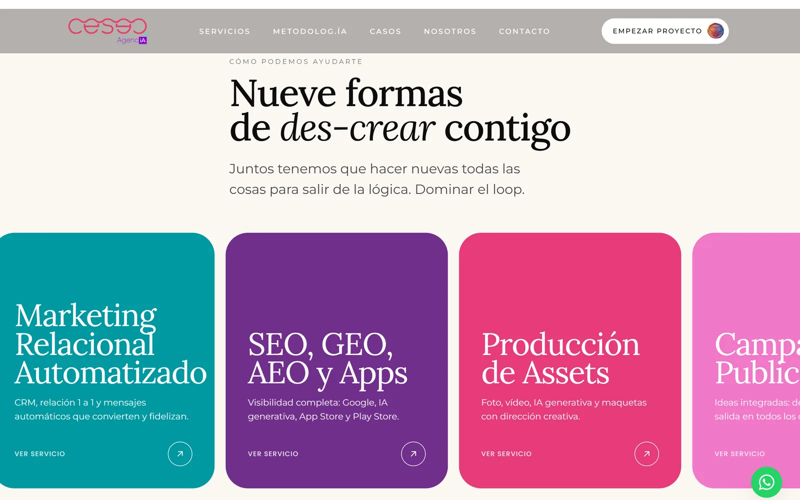 <b>Home · services.</b> A horizontal scroll-track that pins and pans through the nine service lines.</td>
    <td width="50%">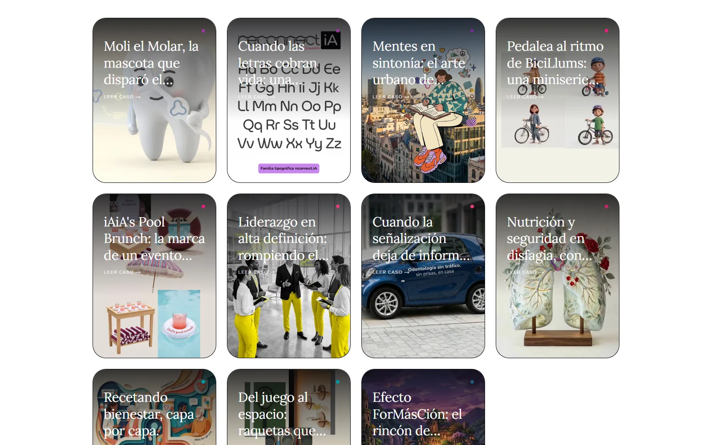 <b>Case index.</b> Poster grid ordered by service colour, so cases from the same discipline sit together.</td>
  </tr>
  <tr>
    <td width="50%">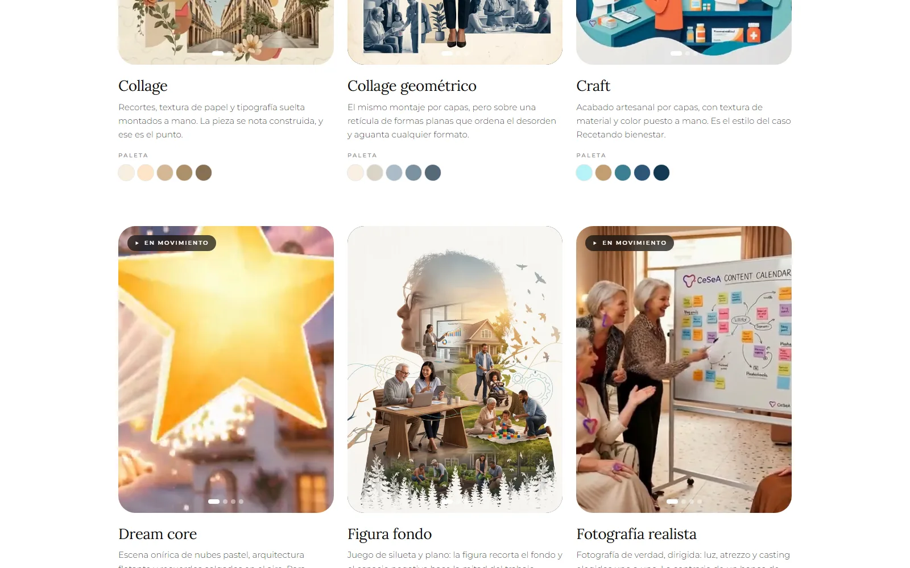 <b>Graphic styles.</b> Eighteen art directions, each with a sampled palette and a muted looping video sample.</td>
    <td width="50%">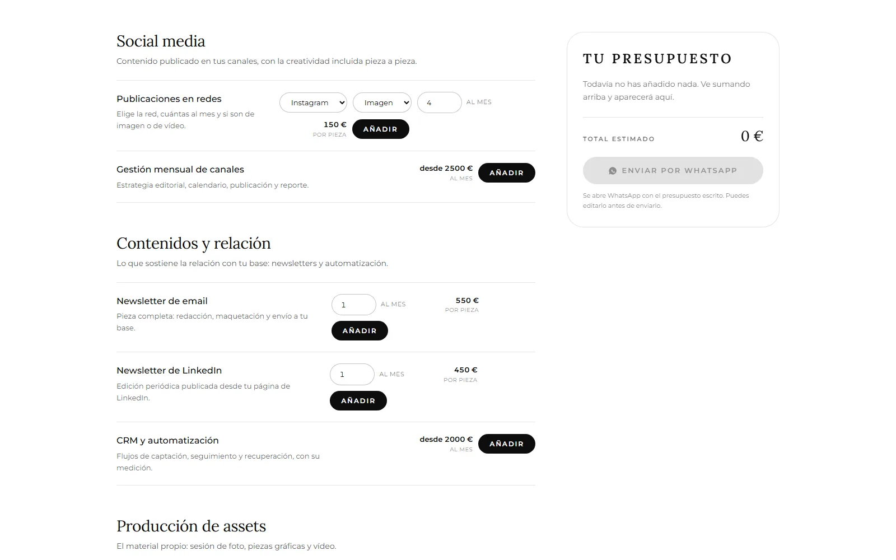 <b>Quote builder.</b> Pick service, network, volume and format; the total adds up live and leaves over WhatsApp.</td>
  </tr>
  <tr>
    <td width="50%">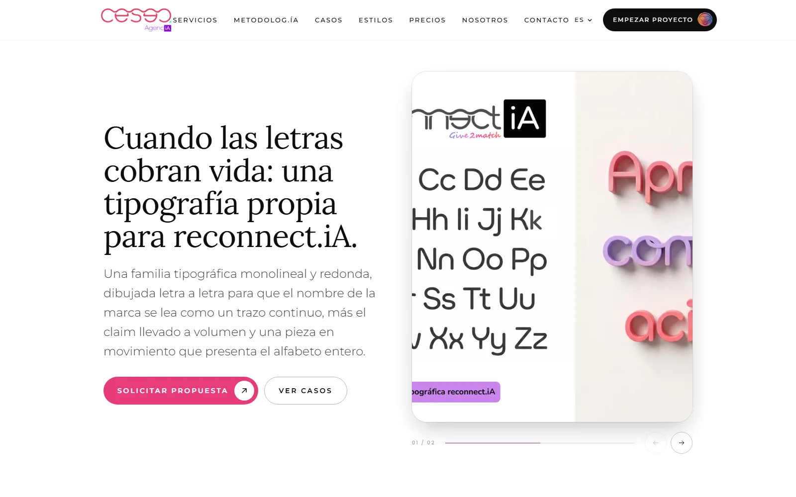 <b>Case study.</b> A reusable template: piece slider, challenge and approach as flip-cards, process timeline, video.</td>
    <td width="50%">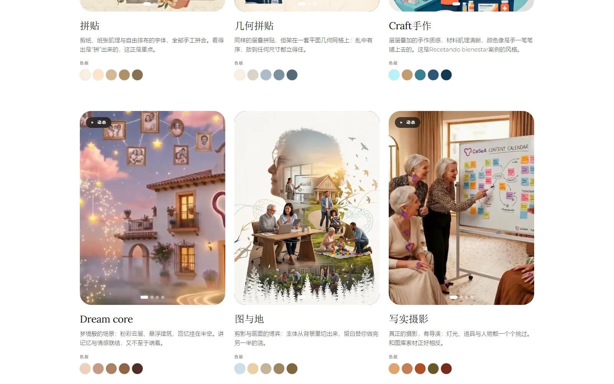 <b>Same page, Simplified Chinese.</b> Identical routes in six languages; CJK falls back to system stacks by design.</td>
  </tr>
  <tr>
    <td width="50%">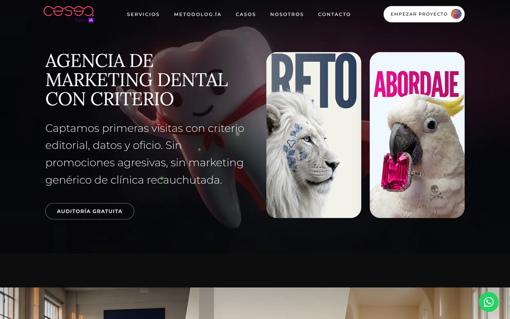 <b>Sector landing.</b> Dark editorial hero with the flip-cards that frame each vertical as <i>reto / abordaje</i>.</td>
    <td width="50%">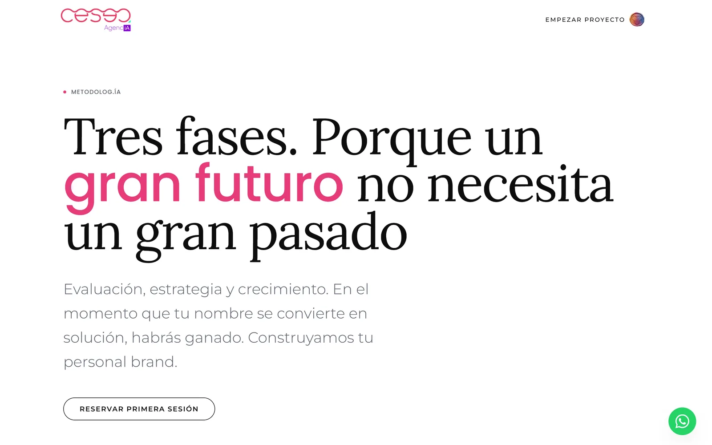 <b>Methodology.</b> Three phases, marked up as <code>HowTo</code> structured data.</td>
  </tr>
  <tr>
    <td width="50%">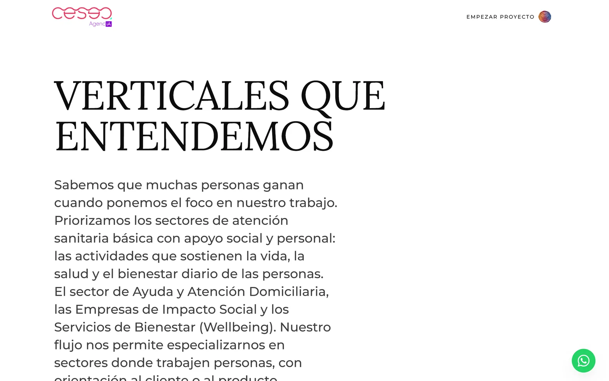 <b>Sectors.</b> Type-led index built on the display serif.</td>
    <td width="50%">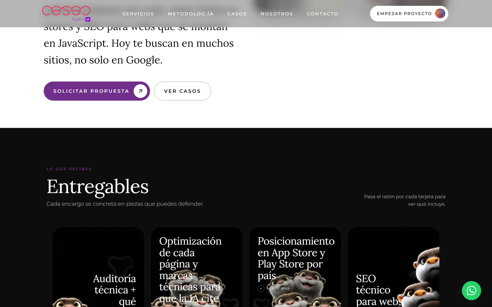 <b>Service detail.</b> Deliverables laid out as hover-to-expand cards.</td>
  </tr>
  <tr>
    <td width="50%">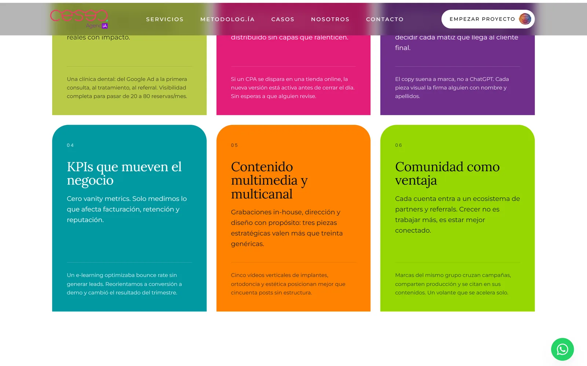 <b>Home · differentiators.</b> Colour-blocked cards over the cream base.</td>
    <td width="50%">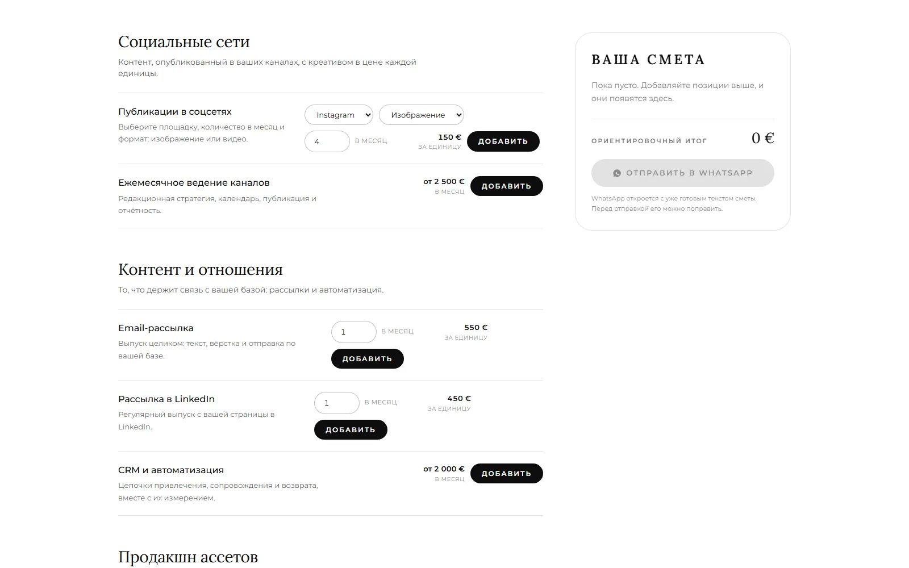 <b>Quote builder, Russian.</b> The same interactive surface, localised down to plural forms and currency format.</td>
  </tr>
</table>

## Stack

| Layer | Choice |
|---|---|
| Framework | Next.js 15 (App Router), React 19 |
| Language | TypeScript |
| Styling | Tailwind CSS v4 — tokens declared in a `@theme` block, no `tailwind.config` |
| Motion | Framer Motion, Lenis (smooth scroll) |
| i18n | next-intl 4 — six locales, ICU messages, reciprocal `hreflang` |
| Type | Lora (display), Montserrat (body), Poppins (labels), self-hosted via `next/font` |
| Forms | React Hook Form + Zod |
| Backend | Next.js route handlers, Nodemailer (SMTP), Supabase, Notion API |
| Media tooling | Node + ffmpeg pipelines for video, posters, palettes and cover crops |
| Delivery | Standalone build, containerised, self-hosted behind a reverse proxy |

Thirteen production dependencies. No component library, no CSS-in-JS, no state client: the state that exists is local and fits in `useState`.

## Architecture

**Rendering & routing.** Everything the public sees is statically generated — 248 pages, six locales. Services, sectors, case studies and graphic styles are dynamic segments resolved at build time through `generateStaticParams`, so a new case study is a data entry, not a new page. The only server code that runs per request is the handful of route handlers behind the forms — the surface that needs a secret is kept deliberately small.

**Six languages, enforced by the compiler.** Spanish, English, French, Italian, Russian and Simplified Chinese, on identical routes, with Spanish left unprefixed so the historical URLs never moved. Language is a deliberate choice, not a guess: no `Accept-Language` sniffing and no locale cookie, which keeps the site deterministic for crawlers and keeps the cookie policy honest.

The interesting part is that translations can't rot. Every content area is typed as `Record<Locale, …Copy>`, so **a missing key in one language is a build error, not a silently English paragraph in the Russian page**. Parallel arrays (image alts, form options) must keep their length, and one case-study rule — the highlighted phrase must be a literal substring of the quote it highlights — is checked over all six languages before release.

**Content as a typed corpus.** Each area is split in two halves: everything non-linguistic (routes, image dimensions, hex colours, slugs, service mappings) lives in `*.shared.ts`, and only prose lives in `<area>/<locale>.ts`. A translator literally cannot break a route or a brand colour, because those aren't in the file they edit. Client components import the `shared` half only, which keeps the whole translated corpus out of the browser bundle.

That split also caught a real failure mode. The type system guarantees the corpus is translated — it can't tell you that a component is reading a *non-localised* module. Three of them were pulling copy from a Spanish snapshot, which is why the footer shipped in Spanish across all five non-Spanish locales until I traced it. The fix removed the tempting export entirely, so the shortcut no longer exists.

**Motion.** The hero is a scroll-scrubbed frame sequence pinned across several viewport heights; scroll position drives playback, with a video fallback. Below it, a velocity-tied marquee, full-bleed scroll chapters, word-by-word reveals and the flip-cards all hang off Lenis and Framer Motion. Two rules kept it honest: no animation may cause layout shift, and everything checks `prefers-reduced-motion` and switches off cleanly.

**Design system.** Three typefaces, a fixed palette, and spacing/colour tokens declared once in a Tailwind v4 `@theme` block. Sections compose from the same primitives, which is why new sector landings, case studies and style cards stay visually consistent with no extra design work.

**SEO & structured data.** This is a marketing agency, so the site has to practise what it sells. It emits a full JSON-LD graph — `Organization` (with each office modelled as a `LocalBusiness`, geo and opening hours), `WebSite` with a `SearchAction`, `Service` catalogues, `FAQPage`, `HowTo`, `BreadcrumbList`, `Article` and `Review` — cross-linked by stable `@id`s, with `inLanguage` per locale. Reciprocal `hreflang` plus `x-default`, a multilingual sitemap generated from the corpus itself, and per-route canonicals and Open Graph. Images are served as AVIF/WebP through `next/image`.

## Quote builder that hands off to WhatsApp

The pricing page is a small commerce surface without a checkout. You pick a service, choose the network from a dropdown, set how many pieces a month and whether they're stills or video — stills and video are priced independently — and the total adds up live. Submitting opens WhatsApp with the quote already written out, so there's no form to wait on and no lead sitting in an inbox.

Two decisions carry it:

- **One source of truth for money.** The rate card lives in a single typed module that feeds the page, the WhatsApp message and the spreadsheet the agency imports into FileMaker. They cannot drift, because there is nothing to keep in sync.
- **Unpriced work stays unpriced.** Anything the rate card resolves "on production" is modelled as `price: null`: it can be added to the quote and travels in the message, but it never invents a number or silently inflates a total.

The FileMaker export writes a real `.xlsx` by generating the OOXML parts and packing the ZIP with `zlib` — local headers, CRC32, central directory — rather than pulling a spreadsheet library into a project that only needs to emit one report. It also drops a `;`-separated CSV with a BOM, which is what Excel in Spanish and FileMaker actually expect.

## Media pipelines

Client material arrives as a shared drive full of raw exports. Three Node + ffmpeg scripts turn it into web assets and then **print the TypeScript snippet with the real dimensions** to paste into the corpus, so the data layer can't disagree with the files on disk.

They handle the hero frame sequence, the case-study sets (video, poster, slider pieces, flip-card faces, and 16:9 covers composited over a blurred frame when the source is vertical) and the style samples. The most recent pass took **191.8 MB of raw material down to 10.9 MB of web assets — 94% smaller** — muting and looping the video samples, which are decorative. Every script is idempotent, skips what's missing with a warning instead of failing, and never touches the originals.

On the page, thirteen of those videos share one screen: they load with `preload="none"` and only play while their card is actually on screen, so the landing never starts thirteen downloads at once.

## Lead capture, handled like untrusted input

The forms are the one place a stranger can reach the backend, so they're built defensively.

- **Method-locked and schema-validated.** Endpoints accept `POST` only and parse the body through Zod before anything else touches it — explicit types, bounded string lengths, and a consent field that must be exactly `true`. Anything off-shape is a 400.
- **Rate limited.** Per-IP limiting (client form and internal endpoint on separate budgets) returns `429` past the threshold, with the IP taken from the forwarded headers the proxy sets.
- **Output encoding.** Every dynamic value is HTML-escaped, and the rendered email body is then normalised to numeric entities so accented Spanish survives whatever mail client opens it. The JSON-LD serialiser escapes `<` so structured data can't break out of its `<script>` tag.
- **Secrets stay server-side.** SMTP, Supabase and Notion credentials live only in environment variables. The Supabase service-role key never leaves the server. Nothing sensitive is shipped to the client bundle.
- **Fails soft.** Notification email, confirmation email and datastore writes run under `Promise.allSettled`; if one degrades, the visitor still gets a success response and the lead is never dropped.

## Security assessment

Beyond the lead-capture hardening above, I ran a full security review of this site — reconnaissance, findings, remediation and verification — and used it to add a complete HTTP security-header baseline (a strict `self`-only CSP, HSTS, `nosniff`, `X-Frame-Options: DENY`, `Referrer-Policy`, `Permissions-Policy` and COOP), an access gate on the internal proposal decks, and a handful of smaller fixes. Every finding was remediated and verified in production.

**Full write-up: [SECURITY-ASSESSMENT.md](SECURITY-ASSESSMENT.md).**

Still on the backlog: shared-store rate limiting (Redis) for multi-instance, and a hash- or nonce-based `script-src` to drop `'unsafe-inline'` once the framework's inline-script hashes stabilise or the site moves to per-request rendering.

## Performance & accessibility

Static delivery keeps TTFB low; fonts are self-hosted and preloaded to avoid a third-party round-trip; images are responsive AVIF/WebP and video is H.264 with `faststart`. There is no third-party JavaScript at all — no analytics, no CDN fonts, no embeds — which is what lets the CSP stay `'self'`.

Motion is opt-out via `prefers-reduced-motion`, focus states are visible throughout, and structure stays semantic so the page reads without JavaScript. Alt text is written per image rather than generated, `aria-label`s are localised across all six languages, and decorative video is muted and marked as such. Cyrillic ships as a real font subset; CJK deliberately falls back to system stacks instead of shipping megabytes of webfont.

---

Designed and built by **Daniel Brosed** — developer and security auditor.
[danielbrosed.com](https://danielbrosed.com) · [LinkedIn](https://www.linkedin.com/in/danielbrosed/)

The site and its content are © CeSeA Agenc.ia. This repository documents the build as a portfolio case study; the screenshots are of the production site and the application source is not included. See [`LICENSE`](LICENSE).
